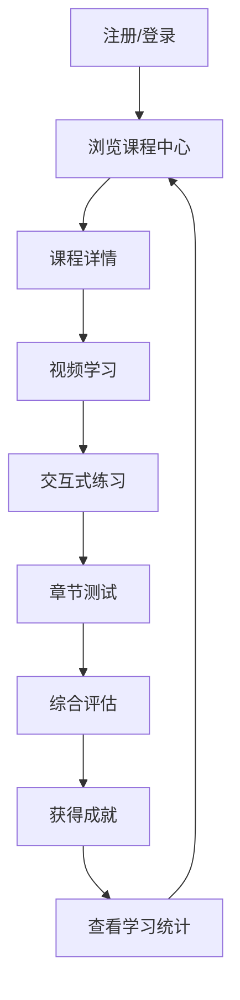

## 1. Product Overview
基于Python的数据分析在线教育平台，为商务数据分析与应用专业学生提供完整的学习体验。
- 提供系统化的数据分析课程，涵盖理论学习、实践练习和评估测试
- 目标是帮助学生掌握数据分析技能，提升就业竞争力

## 2. Core Features

### 2.1 User Roles
| 角色 | 注册方式 | 核心权限 |
|------|---------------------|------------------|
| 学生 | 邮箱注册 | 浏览课程、学习、练习、测评、查看成就 |
| 教师 | 邀请注册 | 管理课程、查看学生进度、评估作业 |

### 2.2 Feature Module
1. **首页**：平台介绍、课程分类、最新动态、登录/注册
2. **课程中心**：课程列表、课程详情、学习进度
3. **学习模块**：视频教程、交互式练习、代码编辑器
4. **测评系统**：章节测试、综合评估、成绩分析
5. **成就系统**：徽章、等级、学习统计
6. **个人中心**：学习记录、个人资料、设置

### 2.3 Page Details
| 页面名称 | 模块名称 | 功能描述 |
|-----------|-------------|---------------------|
| 首页 | 英雄区 | 平台介绍、主要功能展示、快速入口 |
| 首页 | 课程分类 | 按技能级别、主题分类展示课程 |
| 首页 | 最新动态 | 课程更新、活动通知 |
| 课程中心 | 课程列表 | 展示所有课程，支持筛选和搜索 |
| 课程中心 | 课程详情 | 课程大纲、章节内容、学习进度 |
| 学习模块 | 视频教程 | 高清视频播放、进度记忆、字幕 |
| 学习模块 | 交互式练习 | 实时代码执行、结果反馈、提示 |
| 学习模块 | 代码编辑器 | 在线编写和运行Python代码 |
| 测评系统 | 章节测试 | 选择题、编程题、自动评分 |
| 测评系统 | 综合评估 | 项目实战、教师评分 |
| 测评系统 | 成绩分析 | 学习数据可视化、薄弱环节分析 |
| 成就系统 | 徽章系统 | 完成特定任务获得徽章 |
| 成就系统 | 等级系统 | 根据学习进度和成绩提升等级 |
| 成就系统 | 学习统计 | 学习时长、完成课程数、技能掌握度 |
| 个人中心 | 学习记录 | 历史学习记录、收藏课程 |
| 个人中心 | 个人资料 | 基本信息、学习目标、设置 |

## 3. Core Process
### 学生学习流程
1. 注册/登录平台
2. 浏览课程中心，选择感兴趣的课程
3. 进入课程详情页，查看课程大纲
4. 开始学习，观看视频教程
5. 完成交互式练习，巩固知识点
6. 参加章节测试，检验学习成果
7. 完成课程后参加综合评估
8. 获得成就和证书
9. 查看学习统计，了解学习情况

## 4. User Interface Design
### 4.1 Design Style
- 主色调：蓝色(#165DFF)和白色(#FFFFFF)，辅以浅灰(#F5F7FA)作为背景
- 强调色：橙色(#FF7D00)用于按钮和重点元素
- 按钮风格：圆角矩形，轻微阴影，悬停效果
- 字体：无衬线字体，标题使用18-24px，正文14-16px
- 布局风格：卡片式布局，顶部导航栏，响应式设计
- 图标风格：线性图标，简洁现代

### 4.2 Page Design Overview
| 页面名称 | 模块名称 | UI元素 |
|-----------|-------------|-------------|
| 首页 | 英雄区 | 大标题+副标题，背景使用渐变效果，包含CTA按钮 |
| 首页 | 课程分类 | 卡片式布局，每个分类包含图标和名称，悬停时有放大效果 |
| 课程中心 | 课程列表 | 网格布局，每门课程显示封面、标题、难度、进度条 |
| 学习模块 | 视频教程 | 全屏视频播放器，侧边栏显示章节列表，进度指示器 |
| 学习模块 | 代码编辑器 | 分屏设计，左侧代码编辑区，右侧运行结果区 |
| 测评系统 | 章节测试 | 简洁的题目展示，选项卡片，提交按钮 |
| 成就系统 | 徽章系统 | 网格展示徽章，获得的徽章高亮显示，未获得的灰度显示 |

### 4.3 Responsiveness
- 桌面优先设计，适配1200px以上屏幕
- 平板设备适配768px-1199px屏幕
- 移动设备适配320px-767px屏幕
- 触摸优化：增大按钮点击区域，支持手势操作

### 4.4 3D Scene Guidance
- 不适用，本项目以2D界面为主