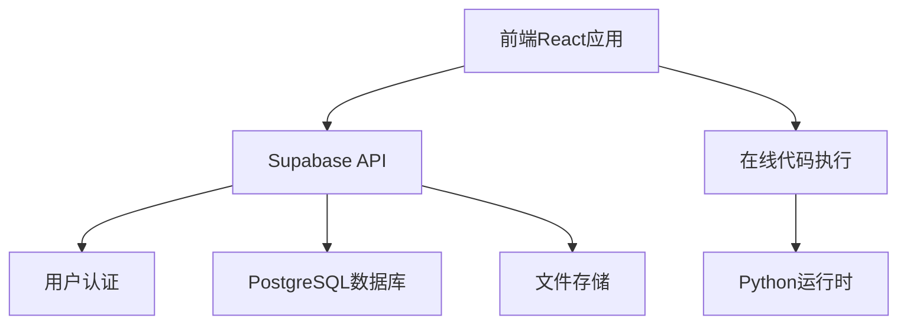
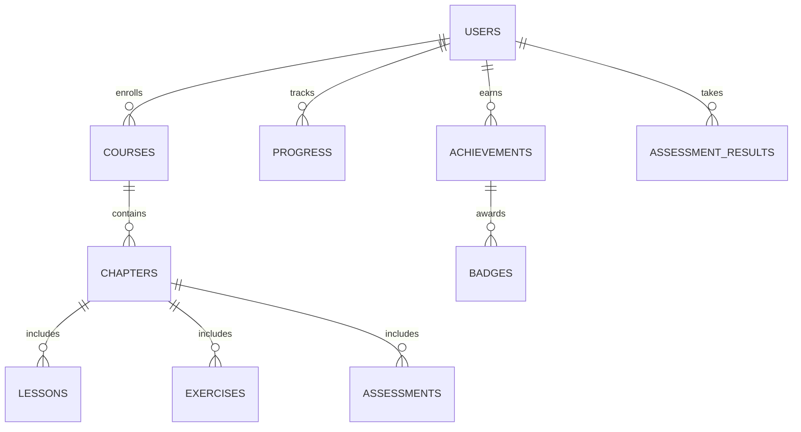

## 1. Architecture Design


## 2. Technology Description
- 前端：React@18 + TypeScript + Tailwind CSS + Vite
- 后端：Supabase (认证、数据库、存储)
- 数据库：Supabase (PostgreSQL)
- 部署：Cloudflare Pages
- 代码执行：Pyodide (浏览器中运行Python)
- 状态管理：Zustand
- 路由：React Router
- UI组件：自定义组件 + Lucide React图标

## 3. Route Definitions
| 路由 | 用途 |
|-------|---------|
| / | 首页 |
| /courses | 课程中心 |
| /courses/:id | 课程详情 |
| /courses/:id/learn/:chapterId | 学习页面 |
| /courses/:id/practice/:exerciseId | 练习页面 |
| /courses/:id/assessment/:testId | 测评页面 |
| /achievements | 成就系统 |
| /profile | 个人中心 |
| /login | 登录页面 |
| /register | 注册页面 |

## 4. API Definitions
### 4.1 Supabase API
- 认证API：用户注册、登录、密码重置
- 数据库API：课程、章节、练习、测评、成就等数据的CRUD操作
- 存储API：课程视频、图片等文件的上传和访问

### 4.2 自定义API
- 代码执行API：运行用户提交的Python代码并返回结果
- 评分API：自动评分用户的编程练习

## 5. Data Model
### 5.1 Data Model Definition


### 5.2 Data Definition Language
```sql
-- 用户表
CREATE TABLE users (
  id UUID PRIMARY KEY,
  email TEXT UNIQUE NOT NULL,
  name TEXT,
  role TEXT DEFAULT 'student',
  created_at TIMESTAMP DEFAULT NOW()
);

-- 课程表
CREATE TABLE courses (
  id UUID PRIMARY KEY,
  title TEXT NOT NULL,
  description TEXT,
  level TEXT,
  category TEXT,
  cover_image TEXT,
  created_at TIMESTAMP DEFAULT NOW()
);

-- 章节表
CREATE TABLE chapters (
  id UUID PRIMARY KEY,
  course_id UUID REFERENCES courses(id),
  title TEXT NOT NULL,
  order_index INTEGER,
  created_at TIMESTAMP DEFAULT NOW()
);

-- 课程内容表
CREATE TABLE lessons (
  id UUID PRIMARY KEY,
  chapter_id UUID REFERENCES chapters(id),
  title TEXT NOT NULL,
  content TEXT,
  video_url TEXT,
  order_index INTEGER,
  created_at TIMESTAMP DEFAULT NOW()
);

-- 练习表
CREATE TABLE exercises (
  id UUID PRIMARY KEY,
  chapter_id UUID REFERENCES chapters(id),
  title TEXT NOT NULL,
  description TEXT,
  difficulty TEXT,
  solution TEXT,
  order_index INTEGER,
  created_at TIMESTAMP DEFAULT NOW()
);

-- 测评表
CREATE TABLE assessments (
  id UUID PRIMARY KEY,
  chapter_id UUID REFERENCES chapters(id),
  title TEXT NOT NULL,
  description TEXT,
  total_points INTEGER,
  created_at TIMESTAMP DEFAULT NOW()
);

-- 测评问题表
CREATE TABLE assessment_questions (
  id UUID PRIMARY KEY,
  assessment_id UUID REFERENCES assessments(id),
  question_text TEXT NOT NULL,
  question_type TEXT,
  options JSONB,
  correct_answer JSONB,
  points INTEGER,
  order_index INTEGER,
  created_at TIMESTAMP DEFAULT NOW()
);

-- 学习进度表
CREATE TABLE progress (
  id UUID PRIMARY KEY,
  user_id UUID REFERENCES users(id),
  lesson_id UUID REFERENCES lessons(id),
  completed BOOLEAN DEFAULT false,
  last_accessed TIMESTAMP,
  created_at TIMESTAMP DEFAULT NOW()
);

-- 练习提交表
CREATE TABLE exercise_submissions (
  id UUID PRIMARY KEY,
  user_id UUID REFERENCES users(id),
  exercise_id UUID REFERENCES exercises(id),
  code TEXT,
  result TEXT,
  score INTEGER,
  submitted_at TIMESTAMP DEFAULT NOW()
);

-- 测评结果表
CREATE TABLE assessment_results (
  id UUID PRIMARY KEY,
  user_id UUID REFERENCES users(id),
  assessment_id UUID REFERENCES assessments(id),
  score INTEGER,
  submitted_at TIMESTAMP DEFAULT NOW()
);

-- 成就表
CREATE TABLE achievements (
  id UUID PRIMARY KEY,
  user_id UUID REFERENCES users(id),
  badge_id UUID REFERENCES badges(id),
  earned_at TIMESTAMP DEFAULT NOW()
);

-- 徽章表
CREATE TABLE badges (
  id UUID PRIMARY KEY,
  name TEXT NOT NULL,
  description TEXT,
  icon TEXT,
  requirement JSONB,
  created_at TIMESTAMP DEFAULT NOW()
);

-- 课程报名表
CREATE TABLE course_enrollments (
  id UUID PRIMARY KEY,
  user_id UUID REFERENCES users(id),
  course_id UUID REFERENCES courses(id),
  enrolled_at TIMESTAMP DEFAULT NOW(),
  completed_at TIMESTAMP
);

-- 权限设置
GRANT SELECT ON ALL TABLES TO anon;
GRANT ALL PRIVILEGES ON ALL TABLES TO authenticated;
```

## 6. 部署方案
- 前端：使用Cloudflare Pages部署，配置自动构建和部署
- 后端：使用Supabase作为BaaS，无需单独部署
- 数据存储：Supabase PostgreSQL数据库
- 文件存储：Supabase Storage
- 代码执行：使用Pyodide在浏览器中运行Python代码，无需后端服务器

## 7. 性能优化
- 前端：使用React.lazy()和Suspense实现组件懒加载
- 图片：使用Cloudflare Images进行图片优化和CDN加速
- 代码分割：按路由分割代码，减少初始加载时间
- 缓存策略：利用浏览器缓存和Service Worker

## 8. 安全考虑
- 使用Supabase Auth进行用户认证，防止未授权访问
- 对用户提交的代码进行安全沙箱处理，防止恶意代码执行
- 使用HTTPS加密传输，保护用户数据安全
- 定期备份数据，防止数据丢失